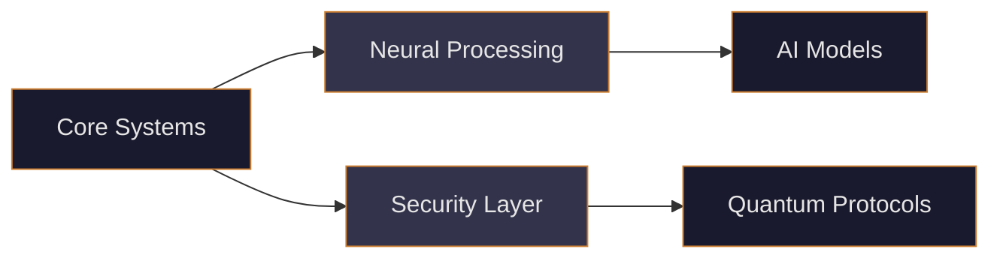

  

  <h1 style="color: #1A1A2E;">Aeon Nova Future Labs</h1>
  
  
  
  

## 🚀 About Us

Aeon Nova Future Labs is at the forefront of innovative technology solutions, specializing in:

- 🔮 Advanced AI Systems & Neural Networks
- 🔒 Quantum-Safe Security Protocols
- 🌐 Decentralized Architecture
- 📊 Data Sovereignty Solutions

## 🛠️ Our Technology Stack

## 🌟 Featured Projects

  
  <!-- Add more project cards as they are developed -->

## 👥 Our Team

Meet the brilliant minds behind our innovations:

  <!-- Team member cards will be dynamically generated -->
  

## 📈 Organization Stats

  

## 🤝 Join Us

We're always looking for talented individuals to join our mission. Check out our [open positions](https://aeonnovafuturelabs.com/careers) or contribute to our open-source projects.

  

