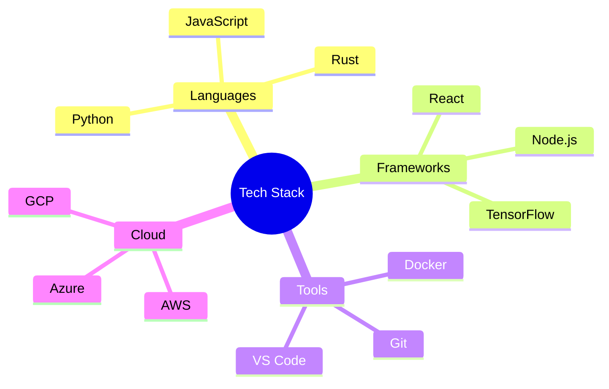

<div align="center">
  

  <h1 style="color: #1A1A2E;">Hi there, I'm [Your Name] 👋</h1>
  
  [](https://github.com/yourusername)
  [](https://linkedin.com/in/yourprofile)
  [](https://yourportfolio.com)
</div>

## 🌟 About Me

> Software Engineer at [Aeon Nova Future Labs](https://github.com/AeonNovaFutureLabs)

I specialize in building robust, scalable solutions with a focus on:
- 🧠 AI/ML Systems
- 🔐 Security Architecture
- 🎨 UI/UX Design
- 🚀 Performance Optimization

## 💻 Tech Stack



## 🔥 GitHub Stats

<div align="center">
  
  
</div>

## 🎯 Current Focus

- 📚 Learning [New Technology]
- 🔨 Building [Project Name]
- 📝 Writing about [Topic]

## 📊 Weekly Development Breakdown

<!--START_SECTION:waka-->
```text
Python       12 hrs 40 mins  ███████████░░░░  45.2%
JavaScript   8 hrs 15 mins   ██████░░░░░░░░░  29.4%
TypeScript   4 hrs 30 mins   ███░░░░░░░░░░░░  16.1%
Docker       2 hrs 10 mins   ██░░░░░░░░░░░░░   7.7%
Other        25 mins         ░░░░░░░░░░░░░░░   1.6%
```
<!--END_SECTION:waka-->

## 🌐 Recent Activity

<!--START_SECTION:activity-->
1. 🎉 Merged PR in [Repository]
2. 💪 Opened PR in [Repository]
3. 🗣 Commented on [Issue]
<!--END_SECTION:activity-->

<div align="center">
  
</div>
